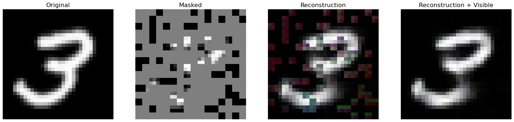

# MASKED AUTO ENCODERS 

A simple, unofficial implementation of MAE ([Masked Autoencoders are Scalable Vision Learners](https://arxiv.org/pdf/2111.06377))

- The model is quite small with only 7 million parameters 
- The model was train on the CIFAR10 dataset 
- The model was train for only 320 Epochs  
- We train the model on a single L4 GPU over the course of 8 hours 

# Examples 

<p align="center">
  
</p>

<p align="center">
  
</p>

<p align="center">
  
</p>


# Setup 

- First git clone the repo 
```bash
git clone https://github.com/dame-cell/Masked-AutoEncoders.git
cd Masked-AutoEncoders
pip install  -r requirements.txt
```
# Usage 

- For training the model you can simply 
```python 
python training_model.py --epochs 320 --lr 0.0001 --batch_size 128
```
- For training the  linear probe without the pretrained encoder

```python 
!python train_linear_probe.py --epochs 10  --lr 0.0001 --batch_size 128 --pretrained False 
```
- For training the  linear probe with the pretrained encoder
```python 
!python train_linear_probe.py --epochs 10  --lr 0.0001 --batch_size 128 --pretrained True --path_to_model your downloaded model from hugginface 
```

# Hyper-parameters
| **Hyperparameter** | **Description**                     | **Value**      |
|--------------------|-------------------------------------|----------------|
| `epochs`           | Number of training epochs           | 120            |
| `lr`               | Learning rate                       | 1e-4           |
| `batch_size`       | Batch size for training/validation   | 128            |
| `weight_decay`     | Weight decay for optimizer           | 1e-4           |
| `eval_interval`    | Evaluation interval during training  | 100 steps      |
| `seed`             | Random seed for reproducibility      | 42             |
| `mask_ratio`       | Masking ratio for MAE                | 0.75           |
| `optimizer`        | Optimizer                           | AdamW          |
| `lr_scheduler`     | Learning rate scheduler             | Cosine decay + warmup |

# Inference 
For trying the pre-trained model you can head to this [colab notebook](https://colab.research.google.com/drive/1QOurYLXHTrNgxUcv7AqbiaFeaNmV6Oi4?usp=sharing)
# Train and val loss 

The model was train for only 320 epochs 

<p align="center">
  
</p>

# Refrence 
The code for the model was taken from [IcarusWizard](https://github.com/IcarusWizard/MAE) with a few modifications 
